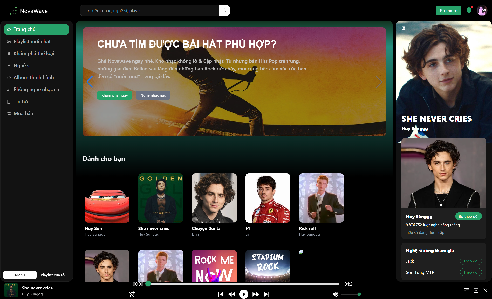
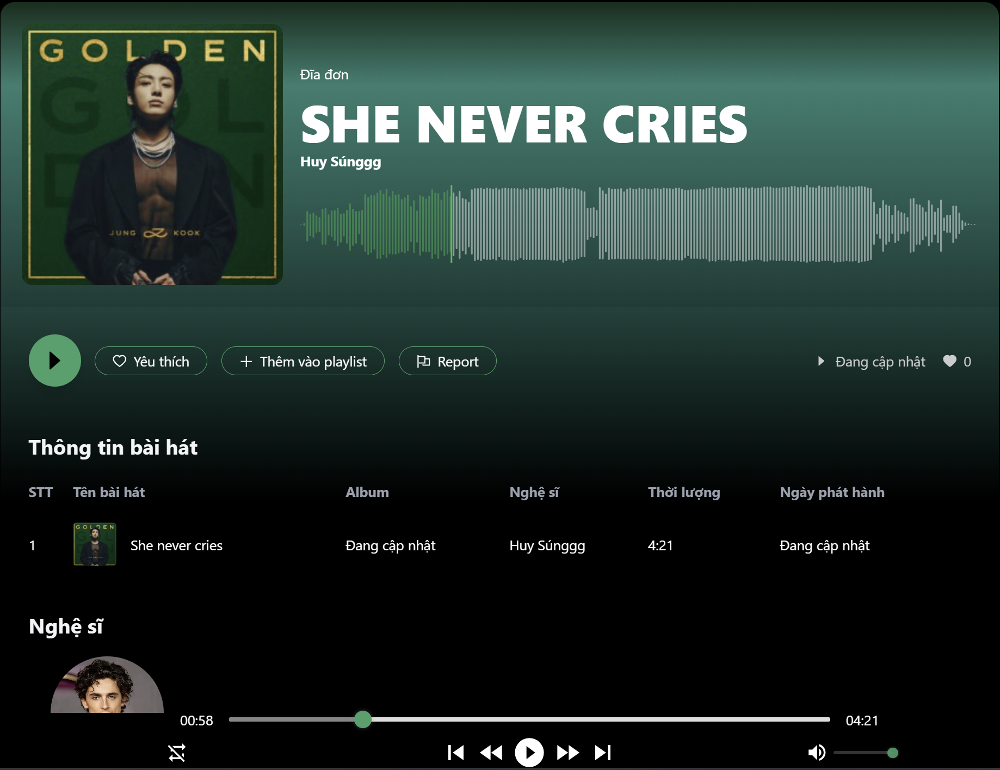
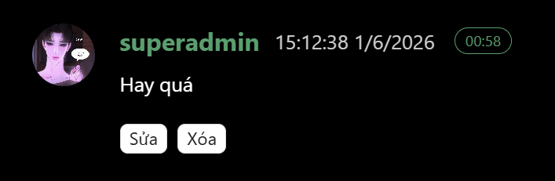
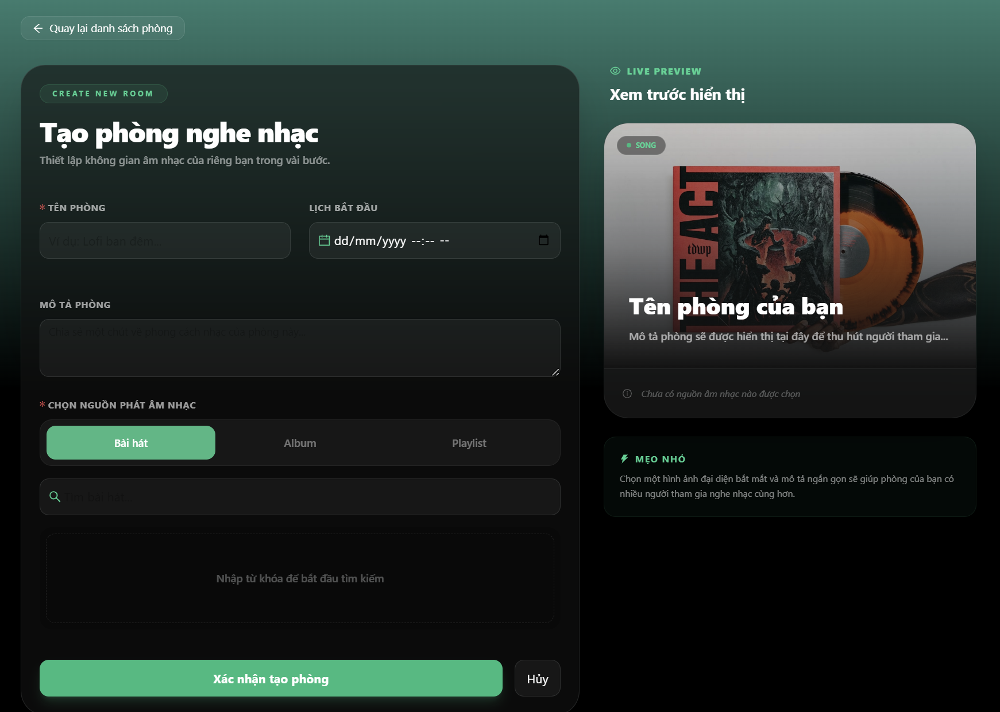
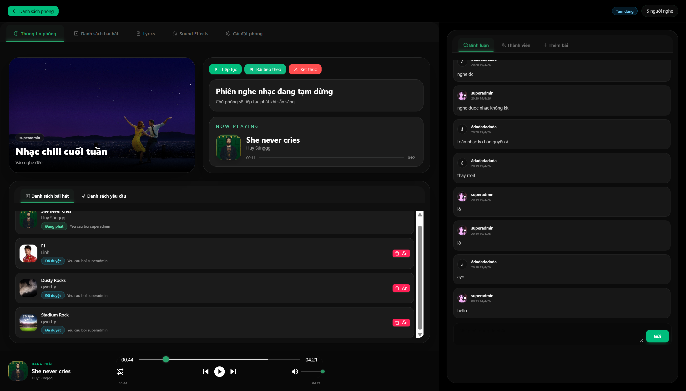

<div align="center">

# 🎵 NOVAWAVE

### *A Modern Music Streaming Platform*

[](https://nextjs.org/)
[](https://reactjs.org/)
[](https://www.typescriptlang.org/)
[](https://tailwindcss.com/)
[](https://ant.design/)

NovaWave là một nền tảng nghe nhạc trực tuyến (music streaming platform) được phát triển với mục tiêu cung cấp trải nghiệm thưởng thức âm nhạc toàn diện cho người dùng. Ứng dụng tích hợp đầy đủ các chức năng từ phát nhạc, quản lý thư viện cá nhân cho đến các tính năng cộng đồng như nghe nhạc cùng nhau theo thời gian thực, mua nhạc, đăng ký gói Premium và hệ thống quản trị nội dung. 


</div>

---

## 📋 Mục lục

- [✨ Tính năng](#-tính-năng)
- [🛠️ Công nghệ sử dụng](#️-công-nghệ-sử-dụng)
- [📁 Cấu trúc dự án](#-cấu-trúc-dự-án)
- [🚀 Cài đặt & Chạy dự án](#-cài-đặt--chạy-dự-án)
- [⚙️ Biến môi trường](#️-biến-môi-trường)
- [📄 Các trang chính](#-các-trang-chính)
- [🔐 Xác thực & Phân quyền](#-xác-thực--phân-quyền)

---

## ✨ Tính năng

- 🎵 **Phát nhạc** – Trình phát nhạc đồng bộ với sóng nhạc và các component liên quan
- 💬 **Bình luận nhạc** - Bình luận bài hát
- ❤️ **Thả tim bài hát** - Thả tim bài hát
- 🎤 **Quản lý nghệ sĩ / album / thể loại** – Nghệ sĩ sau khi đăng ký sẽ được upload nhạc, album.
- 📋 **Playlist cá nhân** – Tạo, chỉnh sửa và quản lý danh sách bài hát
- 🏠 **Phòng nghe nhạc (Room)** – Nghe nhạc cùng nhau theo thời gian thực qua WebSocket
- 🔍 **Tìm kiếm** – Tìm kiếm bài hát, nghệ sĩ, album, playlist, thể loại nhanh chóng
- 🛒 **Giỏ hàng & Thanh toán** – Mua nhạc / gói Premium
- 📰 **Tin tức** – Cập nhật tin tức âm nhạc mới nhất
- 👤 **Hồ sơ cá nhân** – Quản lý thông tin tài khoản
- 🔐 **Xác thực đầy đủ** – Đăng nhập, đăng ký, quên mật khẩu, xác minh OTP
- 🛡️ **Bảng quản trị (Admin)** – Quản lý toàn bộ nền tảng

---

## 🛠️ Công nghệ sử dụng

| Công nghệ | Phiên bản | Mô tả |
|---|---|---|
| [Next.js](https://nextjs.org/) | 16+ | Framework React với App Router |
| [React](https://reactjs.org/) | 19 | UI Library |
| [TypeScript](https://www.typescriptlang.org/) | 5+ | Type-safe JavaScript |
| [TailwindCSS](https://tailwindcss.com/) | 4 | Utility-first CSS framework |
| [Ant Design](https://ant.design/) | 5 | Component UI library |
| [Redux Toolkit](https://redux-toolkit.js.org/) | 2 | Global state management |
| [Zustand](https://zustand-demo.pmnd.rs/) | 5 | Lightweight state management |
| [TanStack Query](https://tanstack.com/query) | 5 | Server state & caching |
| [Axios](https://axios-http.com/) | 1 | HTTP client |
| [Socket.IO Client](https://socket.io/) | 4 | Real-time communication |
| [WaveSurfer.js](https://wavesurfer.xyz/) | 7 | Audio waveform visualization |
| [Ant Design Charts](https://charts.ant.design/) | 2 | Data visualization |
| [TinyMCE React](https://www.tiny.cloud/) | 6 | Rich text editor |
| [Swiper](https://swiperjs.com/) | 12 | Touch slider / carousel |
| [jwt-decode](https://github.com/auth0/jwt-decode) | 4 | JWT token decoding |

---

## 📁 Cấu trúc dự án

```
novawave_fe/
├── public/                    # Static assets (images, icons, videos)
├── src/
│   ├── app/                   # Next.js App Router
│   │   ├── (client)/          # Layout nhóm cho client
│   │   │   ├── (home)/        # Trang chủ
│   │   │   ├── about/         # Trang giới thiệu
│   │   │   ├── album/         # Trang album
│   │   │   ├── artist/        # Trang nghệ sĩ
│   │   │   ├── cart/          # Giỏ hàng
│   │   │   ├── genre/         # Thể loại nhạc
│   │   │   ├── news/          # Tin tức
│   │   │   ├── payment/       # Thanh toán
│   │   │   ├── plan/          # Gói dịch vụ
│   │   │   ├── playlist/      # Playlist
│   │   │   ├── product/       # Sản phẩm
│   │   │   ├── profile/       # Hồ sơ cá nhân
│   │   │   ├── room/          # Phòng nghe nhạc
│   │   │   ├── search/        # Tìm kiếm
│   │   │   └── song/          # Bài hát
│   │   ├── admin/             # Bảng quản trị
│   │   ├── auth/              # Xác thực (login, register, ...)
│   │   ├── callback/          # OAuth callback
│   │   ├── roomDetail/        # Chi tiết phòng nhạc [id]
│   │   ├── layout.tsx         # Root layout
│   │   └── globals.css        # Global styles
│   ├── components/
│   │   ├── admin/             # Components cho admin
│   │   ├── client/            # Components cho client
│   │   ├── common/            # Components dùng chung
│   │   └── provider/          # Context / Provider components
│   ├── hooks/                 # Custom React hooks
│   ├── libs/                  # Cấu hình thư viện (axios, ...)
│   ├── queries/               # TanStack Query hooks
│   ├── services/              # API service functions
│   ├── stores/                # Zustand / Redux stores
│   ├── types/                 # TypeScript type definitions
│   └── middleware.ts          # Next.js middleware (auth guard)
├── .env                       # Biến môi trường (local)
├── next.config.ts             # Cấu hình Next.js
├── package.json
└── tsconfig.json
```

---

## 🚀 Cài đặt & Chạy dự án

### Yêu cầu hệ thống

- **Node.js** >= 18.x
- **npm** >= 9.x hoặc **yarn** >= 1.22.x

### Bước 1: Clone dự án

```bash
git clone https://github.com/henruysun2511/novawave.git
cd novawave_fe
```

### Bước 2: Cài đặt dependencies

```bash
npm install
```

### Bước 3: Cấu hình biến môi trường

Tạo file `.env` tại thư mục gốc (copy từ `.env.example` nếu có):

```bash
cp .env.example .env
```

Sau đó cập nhật các giá trị trong file `.env` (xem phần [Biến môi trường](#️-biến-môi-trường)).

### Bước 4: Chạy môi trường phát triển

```bash
npm run dev
```

Ứng dụng sẽ chạy tại: **http://localhost:3001** (hoặc port khác nếu 3001 đã bị chiếm)

### Build cho Production

```bash
npm run build
npm run start
```

### Lint code

```bash
npm run lint
```

---

## ⚙️ Biến môi trường

Tạo file `.env` ở thư mục gốc dự án với nội dung sau:

```env
# URL API của backend
NEXT_PUBLIC_API_URL=http://localhost:3000/api/v1

# API Key của TinyMCE (rich text editor)
NEXT_PUBLIC_TINY_API_KEY=your_tinymce_api_key_here

# URL Socket.IO server (thường trùng với backend URL không có /api/v1)
NEXT_PUBLIC_SOCKET_URL=http://localhost:3000
```

| Biến | Mô tả | Ví dụ |
|---|---|---|
| `NEXT_PUBLIC_API_URL` | Base URL của REST API backend | `http://localhost:3000/api/v1` |
| `NEXT_PUBLIC_TINY_API_KEY` | API Key từ [TinyMCE Cloud](https://www.tiny.cloud/) | `abc123...` |
| `NEXT_PUBLIC_SOCKET_URL` | URL server Socket.IO cho real-time | `http://localhost:3000` |

> **Lưu ý:** Các biến có tiền tố `NEXT_PUBLIC_` sẽ được expose ra phía client. Không đặt thông tin nhạy cảm vào các biến này.

---

## 📄 Các trang chính

| Route | Mô tả | Yêu cầu đăng nhập |
|---|---|---|
| `/` | Trang chủ | ❌ |
| `/song/[id]` | Chi tiết bài hát | ❌ |
| `/album/[id]` | Chi tiết album | ❌ |
| `/artist/[id]` | Trang nghệ sĩ | ❌ |
| `/genre/[id]` | Thể loại nhạc | ❌ |
| `/playlist/[id]` | Chi tiết playlist | ❌ |
| `/search` | Tìm kiếm | ❌ |
| `/news` | Tin tức | ❌ |
| `/about` | Giới thiệu | ❌ |
| `/room` | Danh sách phòng nhạc | ✅ |
| `/roomDetail/[id]` | Phòng nghe nhạc cùng nhau | ✅ |
| `/playlist` | Playlist của tôi | ✅ |
| `/profile` | Hồ sơ cá nhân | ✅ |
| `/cart` | Giỏ hàng | ✅ |
| `/plan` | Gói dịch vụ | ✅ |
| `/payment` | Thanh toán | ✅ |
| `/admin` | Bảng quản trị | ✅ (Admin) |
| `/auth/login` | Đăng nhập | ❌ |
| `/auth/register` | Đăng ký | ❌ |
| `/auth/forgot-password` | Quên mật khẩu | ❌ |
| `/auth/verify-otp` | Xác minh OTP | ❌ |
| `/auth/reset-password` | Đặt lại mật khẩu | ❌ |

---

## 🔐 Xác thực & Phân quyền

Dự án sử dụng **JWT (JSON Web Token)** lưu trong cookie (`accessToken`) để xác thực người dùng.

### Luồng xác thực (Middleware)

```
Request đến
    │
    ├─ Trang Auth (Login/Register) + Có token hợp lệ → Redirect về "/"
    │
    ├─ Trang Public (/, /song, /album, /artist, /genre, /playlist, /search, /news, /about) → Cho qua
    │
    ├─ Không có token → Redirect về "/auth/login"
    │
    └─ Có token nhưng hết hạn → Xóa cookie + Redirect về "/auth/login"
```

### Phân quyền

- **Guest** – Xem trang chủ, duyệt nhạc, tìm kiếm, xem tin tức
- **User** – Tất cả tính năng Guest + phòng nghe nhạc, playlist, thanh toán, hồ sơ
- **Artist** – Upload file nhạc, quản lý bài hát, album
- **Admin** – Toàn quyền + truy cập bảng quản trị `/admin`

---

## 🎤 Nghe nhạc
Chức năng nghe nhạc là chức năng cốt lõi của NovaWave, cho phép người dùng thưởng thức âm nhạc một cách liền mạch và cá nhân hóa. Hệ thống hỗ trợ đầy đủ các thao tác điều khiển như phát/tạm dừng, tua bài hát, chuyển bài tiếp theo hoặc quay lại bài hát trước. Ngoài ra, nền tảng còn cung cấp nhiều chế độ phát nhạc khác nhau nhằm đáp ứng đa dạng nhu cầu sử dụng của người dùng.



### 🎮 Điều khiển phát nhạc

Người dùng có thể thực hiện các thao tác:

- Phát hoặc tạm dừng bài hát.
- Tua nhanh hoặc tua lùi đến vị trí mong muốn.
- Chuyển sang bài hát tiếp theo.
- Quay lại bài hát trước đó.
- Điều chỉnh âm lượng phát nhạc.

### 💎 Trải nghiệm Premium

Hệ thống hỗ trợ hai loại trải nghiệm:

| Người dùng thường | Người dùng Premium |
|------------------|-------------------|
| Sau mỗi 3 bài hát sẽ xuất hiện 1 quảng cáo | Không xuất hiện quảng cáo |
| Không thể bỏ qua quảng cáo | Nghe nhạc liên tục |


> **Lưu ý:** Quảng cáo không cho phép tua hoặc bỏ qua nhằm đảm bảo hiệu quả quảng bá nội dung.

### 🔀 Các chế độ phát nhạc

#### Nghe nhạc đơn

Khi người dùng phát một bài hát riêng lẻ, hệ thống sẽ tự động đề xuất và phát ngẫu nhiên bài hát tiếp theo sau khi bài hát hiện tại kết thúc.

#### 📀 Nghe theo Album hoặc Playlist

Các bài hát sẽ được phát tuần tự theo danh sách đã được định nghĩa trong Album hoặc Playlist mà người dùng lựa chọn.

#### 📋 Phát từ hàng đợi (Queue)

Hệ thống phát nhạc theo đúng thứ tự trong danh sách hàng đợi do người dùng thiết lập và giữ nguyên cấu trúc của danh sách này trong suốt quá trình phát.

### 🌊 Đồng bộ sóng nhạc (Waveform)

NovaWave hỗ trợ đồng bộ hai chiều giữa thanh tiến trình và sóng âm thanh:

- Kéo **Song Bar** sẽ cập nhật vị trí tương ứng trên sóng nhạc.
- Tương tác trực tiếp trên **Waveform** sẽ thay đổi thời điểm phát của bài hát.
- Mọi thay đổi đều được cập nhật theo thời gian thực nhằm mang lại trải nghiệm trực quan và chính xác.



### 🎵 Đồng bộ Sidebar

Sidebar luôn hiển thị thông tin của bài hát đang phát theo thời gian thực, bao gồm:

- Ảnh bìa bài hát.
- Tên bài hát.
- Nghệ sĩ thể hiện.
- Album liên quan.

Tại đây, người dùng cũng có thể thực hiện thao tác **Follow** hoặc **Unfollow** nghệ sĩ mà không cần chuyển sang trang thông tin nghệ sĩ.

## 💬 Bình luận nhạc đồng bộ với sóng âm
NovaWave cung cấp tính năng bình luận theo thời gian thực gắn liền với nội dung bài hát, giúp người dùng tương tác trực tiếp với từng khoảnh khắc trong bản nhạc.

⏱️ Bình luận theo mốc thời gian

Khi người dùng gửi bình luận, hệ thống sẽ tự động lưu lại thời điểm hiện tại của bài hát và liên kết thời gian đó với nội dung bình luận.

Mỗi bình luận đều hiển thị kèm mốc thời gian tương ứng.
Nhấn vào mốc thời gian để chuyển ngay đến đoạn nhạc được bình luận.
Thanh tiến trình và sóng nhạc được cập nhật đồng bộ theo vị trí được chọn.



🌊 Hiển thị trên sóng nhạc

Để tăng tính trực quan, avatar của người dùng sẽ được hiển thị trực tiếp trên sóng nhạc tại vị trí mà bình luận được tạo.

Dễ dàng nhận biết các đoạn nhạc có nhiều tương tác.
Nhanh chóng truy cập đến các cuộc thảo luận nổi bật.
Tạo trải nghiệm nghe nhạc mang tính cộng đồng và tương tác cao.


## ❤️ Thả tim bài hát
NovaWave cho phép người dùng lưu lại các bài hát yêu thích thông qua chức năng thả tim, giúp xây dựng thư viện âm nhạc cá nhân một cách thuận tiện.

🎵 Quản lý bài hát yêu thích

Người dùng có thể:

Thả tim để thêm bài hát vào danh sách yêu thích.
Hủy thả tim để xóa bài hát khỏi danh sách yêu thích.
Truy cập nhanh các bài hát đã yêu thích trong thư viện cá nhân.
⚡ Optimistic UI

Để mang lại trải nghiệm mượt mà, hệ thống sử dụng kỹ thuật Optimistic UI.

Giao diện được cập nhật ngay sau khi người dùng nhấn thả tim.
Không cần chờ phản hồi từ máy chủ để hiển thị kết quả.
Giảm độ trễ cảm nhận và tăng tính tương tác của ứng dụng.
🔄 Đồng bộ dữ liệu

Sau khi giao diện được cập nhật, hệ thống sẽ gửi yêu cầu đến máy chủ để lưu trạng thái yêu thích.

Nếu yêu cầu thành công, trạng thái được giữ nguyên.
Nếu xảy ra lỗi, giao diện sẽ tự động hoàn tác về trạng thái trước đó.
Người dùng sẽ nhận được thông báo tương ứng khi thao tác thất bại.
## 🏠 Phòng nghe nhạc chung

NovaWave cho phép nhiều người dùng cùng tham gia một phòng nghe nhạc và thưởng thức âm nhạc đồng bộ theo thời gian thực.

### 🎵 Tạo và quản lý phòng nhạc

Người dùng có thể tạo phòng nghe nhạc và lựa chọn nguồn phát:

* Bài hát đơn lẻ.
* Album.
* Playlist cá nhân hoặc công khai.



Chủ phòng có quyền:

* ▶️ Bắt đầu phiên nghe nhạc.
* ⏸️ Tạm dừng hoặc tiếp tục phát.
* ⏹️ Kết thúc phòng nghe nhạc.

Mọi thay đổi đều được cập nhật tức thời đến tất cả thành viên trong phòng.

### ⚡ Đồng bộ phát nhạc Realtime

NovaWave sử dụng WebSocket để đồng bộ trạng thái phát nhạc giữa các thành viên.

* Tua bài hát theo thời gian thực.
* Chuyển bài tiếp theo hoặc bài trước.
* Đồng bộ trạng thái phát/tạm dừng.
* Đảm bảo tất cả thành viên cùng nghe một nội dung tại cùng thời điểm.



### 👥 Thành viên tham gia Realtime

Khi có người tham gia hoặc rời khỏi phòng:

* Danh sách thành viên được cập nhật ngay lập tức.
* Avatar và thông tin người dùng hiển thị theo thời gian thực.
* Chủ phòng dễ dàng theo dõi trạng thái hoạt động của phòng.

### 💬 Trò chuyện trực tiếp

Các thành viên có thể trao đổi và tương tác thông qua hệ thống bình luận thời gian thực.

* Gửi tin nhắn ngay trong phòng nghe nhạc.
* Nhận phản hồi tức thời từ các thành viên khác.
* Tạo không gian nghe nhạc mang tính cộng đồng.

### 🎶 Yêu cầu bài hát

Thành viên có thể gửi yêu cầu phát bài hát đến chủ phòng.

* Gửi đề xuất bài hát yêu thích.
* Chủ phòng xem xét và phê duyệt yêu cầu.
* Bài hát được thêm vào hàng đợi sau khi được chấp nhận.

### 🛡️ Quản lý thành viên

Để duy trì môi trường nghe nhạc lành mạnh, chủ phòng có thể:

* Kick thành viên khỏi phòng.
* Ban thành viên vi phạm.
* Quản lý quyền tham gia phòng nghe nhạc.

Tất cả thay đổi đều được đồng bộ theo thời gian thực nhằm mang lại trải nghiệm cộng đồng mượt mà và liền mạch.

## 🔍 Tìm kiếm nâng cao
NovaWave cung cấp hệ thống tìm kiếm thông minh giúp người dùng không chỉ tìm thấy nội dung mong muốn mà còn khám phá các thông tin liên quan một cách nhanh chóng.


🎵 Tìm kiếm bài hát
Khi tìm kiếm một bài hát, hệ thống sẽ trả về:

Bài hát phù hợp với từ khóa.
Nghệ sĩ thể hiện bài hát.
Album chứa bài hát.
Danh sách thể loại của bài hát.

💿 Tìm kiếm Album
Khi tìm kiếm Album, hệ thống sẽ trả về:

Album phù hợp với từ khóa.
Nghệ sĩ sở hữu hoặc phát hành Album.

🎤 Tìm kiếm Nghệ sĩ
Khi tìm kiếm nghệ sĩ, hệ thống sẽ trả về:

Thông tin nghệ sĩ.
Danh sách bài hát của nghệ sĩ.
Danh sách Album của nghệ sĩ.

🎼 Tìm kiếm Thể loại
Khi tìm kiếm thể loại nhạc, hệ thống sẽ trả về:

Thông tin thể loại.
Danh sách bài hát thuộc thể loại đó.

Nhờ cơ chế liên kết dữ liệu giữa bài hát, nghệ sĩ, album và thể loại, người dùng có thể dễ dàng khám phá thêm các nội dung liên quan chỉ với một lần tìm kiếm, mang lại trải nghiệm duyệt nhạc trực quan và thuận tiện hơn.

## 🚀 Nghệ sĩ & Upload file nhạc
NovaWave hỗ trợ cơ chế đăng ký tài khoản nghệ sĩ, cho phép người dùng phát hành và quản lý nội dung âm nhạc của riêng mình trên nền tảng.

📝 Đăng ký trở thành nghệ sĩ

Để được cấp quyền nghệ sĩ, người dùng cần cung cấp các thông tin xác thực:

Họ và tên.
Số CCCD/CMND.
Thông tin định danh theo yêu cầu của hệ thống.

Sau khi gửi yêu cầu:

Hồ sơ được chuyển đến hệ thống quản trị.
Admin tiến hành kiểm tra và xác minh thông tin.
Tài khoản được nâng cấp thành Artist sau khi được phê duyệt.
🎵 Quản lý bài hát

Nghệ sĩ có thể:

Tạo mới bài hát.
Chỉnh sửa thông tin bài hát.
Xóa bài hát khỏi nền tảng.
Quản lý danh sách các bài hát đã phát hành.

☁️ Upload và lưu trữ nhạc

Các tệp âm thanh được xử lý thông qua Cloudinary nhằm đảm bảo khả năng lưu trữ và phân phối hiệu quả.

Upload file nhạc trực tiếp từ giao diện nghệ sĩ.
Tự động lưu trữ trên Cloudinary.
Quản lý URL và metadata của bài hát.
Tối ưu tốc độ truy cập và phát nhạc trên toàn hệ thống.

🛡️ Kiểm duyệt nội dung

Mọi tài khoản nghệ sĩ đều phải trải qua bước xác thực và phê duyệt bởi Admin trước khi được phép phát hành nội dung, giúp đảm bảo tính minh bạch và chất lượng của nền tảng.

## Các chức năng khác
- Tạo playlist
- Report bài hát
- Follow/unfollow nghệ sĩ
- Thông báo realtime
- Đăng kí gói prenium qua PayOS
- Mua bán/giỏ hàng
- Admin: duyệt nghệ sĩ, quảng lý tài khoản, thể loại, tin tức, quảng cáo, sản phẩm, cấu hình website


<div align="center">

Made by **NHAT HUY**

</div>
